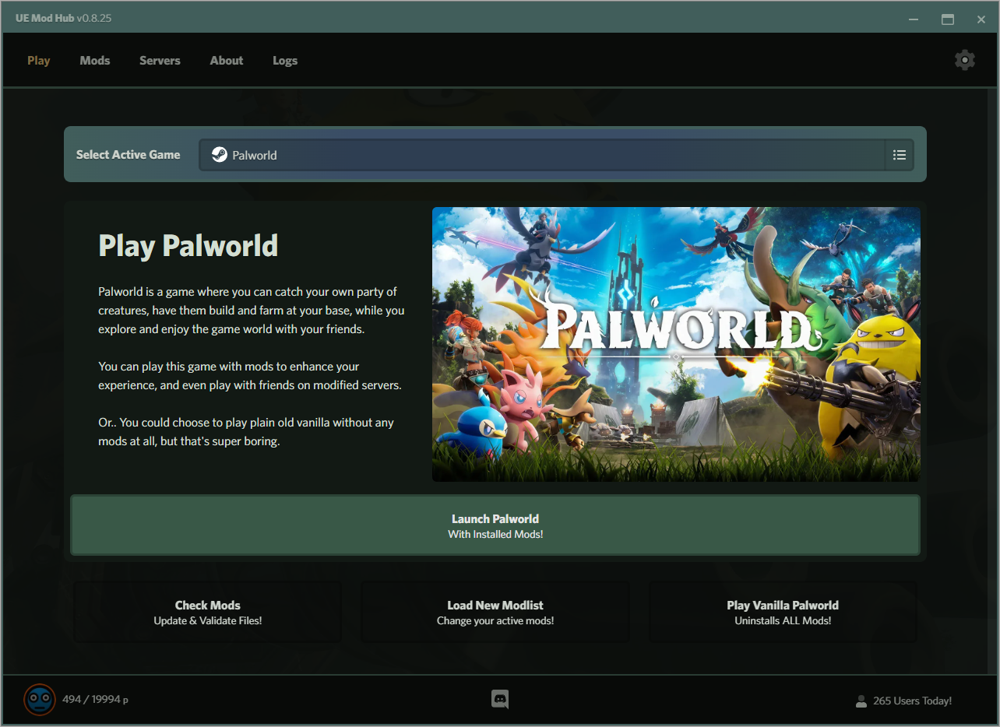

    
    

        
        
        
    

### What is UE Mod Hub
UE Mod Hub is the ULTIMATE Mod Manager for Unreal Engine games, starting with support for the video game Palworld. It allows players to effortlessly manage mods, save/load mod collections to/from a modlist, and most importantly, view/install the requirements for modified servers (for games with dedicated servers)!

Additionally, if you run a server where connecting clients need specific mods, UE Mod Hub offers a plug-and-play solution to the countless hours spent helping users set up mods to join your server. Simply share your server mod list, and users can install all requirements with a single click!

List your server in UE Mod Hub using the `UE Mod Hub (Server Listing Mod)` (coming soon...).

| :exclamation: THIS APP IS IN BETA!! PLEASE REPORT ANY BUGS! |
|---|

### Download Link & Install Guides
- [Download Latest Release](./releases)
- [How to Install App](./resources/readme/install.md)
- [Developer Build](./resources/readme/install-dev.md)

### UE Mod Hub Features
- Painless Installation 
- Easily Navigable Modern UI 
- Guided Setup After Install (w/Automatic Steam Game Path Detection)
- Download & Install Mods From [NexusMods](https://www.nexusmods.com/)
- Effortlessly manage your mod library and active mods with minimal clicks 
- Allows for listing modified servers, their required mods, Discord support servers, and additional information 
- Enables joining modified servers, downloading their required mod list, or joining their Discord support server
- Automatically join selected servers as the game launches (skips the title screen) 
- Automatic App Updates (UE Mod Hub will always be the latest version)
- Customizable Theme + Multiple Defaults 
- Optional Minimize to System Tray
- Optional Auto Minimize App on Launch
- Optional Auto Launch App on System Boot
- [TO-DO] Multi-Platform Support (Windows + Linux)
- [TO-DO] Optional Auto Play Game on Launch
- [TO-DO] System Notifications

### Requirements
- An Unreal Engine game supported by UE Mod Hub (e.g., [Palworld](https://store.steampowered.com/app/1623730/Palworld/)) installed on your machine (Steam or Game Pass versions supported)
- A [NexusMods](https://www.nexusmods.com/) account to download mods via their API
- Windows PC (for release version; Linux/Mac can use developer builds directly with Node.js installed)

### Supported Games
- Palworld
- Palworld Server
- Final Fantasy VII Remake Integrade
- Final Fantasy VII Rebirth
- Hogwarts Legacy
- Black Myth Wukong
- Lockdown Protocol
- Tekken 8
- More coming soon <3

### Technical Details
- [Nextron](https://github.com/saltyshiomix/nextron) (Bundles Next.js with Electron)
    - [Electron](https://www.electronjs.org/)
    - [Next.js](https://nextjs.org/)
    - [React](https://react.dev/)
- [Nexus Mods](https://www.nexusmods.com/) (Enables mod downloads/updates) 
- Custom API Endpoints (For Server Listing / User Counts) [Palworld Only]

