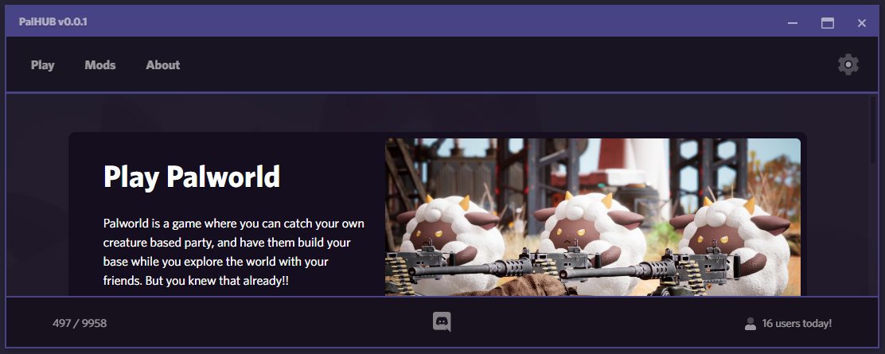

<p align="center"></p>

<div align="center">
<div class="mx-auto d-block">
    
    <a class="mx-2" href="https://discord.gg/DCXh2TUF2u" target="new">
    </a>
    
</div>
</div>


# PalHUB::Client

NOTE: THIS IS A BETA TESTING BUILD AND SHOULD NOT BE USED BY MUGGLES!!


## Additional Details


## Features
- 
- [TODO](/TODO.md) 


## How To Install
Download the latest version from [HERE](https://github.com/Dekita/palhub-client/releases/new). Run the installer. Enjoy <3


## Requirements
- Palworld, obviously...


## Help Guides
- 


## Credit && Thanks
- 


# Run PalHUB Client Locally

### Download Files

```
git clone https://github.com/dekita/palhub-client 
cd ./palhub-client
```

### Install Dependencies

```
$ cd my-app

# using yarn or npm
$ yarn (or `npm install`)

# using pnpm
$ pnpm install --shamefully-hoist
```

### Run Development Mode

```
$ yarn dev (or `npm run dev` or `pnpm run dev`)
```

### Build Application

```
$ yarn build (or `npm run build` or `pnpm run build`)
```
